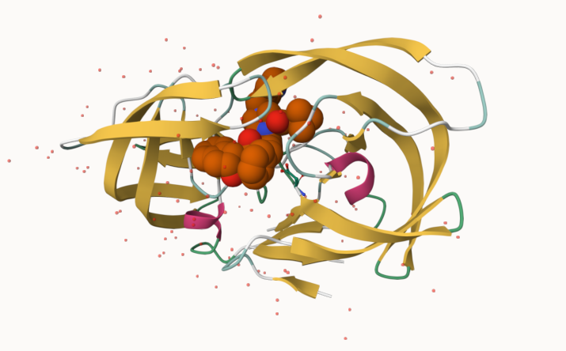

# PDB Statistics

**Q1: What percentage of structures in the PDB are solved by X-Ray and Electron Microscopy.**

93.7892% of structures in the PDB are solved by X-Ray and EM.

```{r}
# Importing PDB file
pdb_stats <- read.csv("pdb_stats.csv")

# Percentage of structures solved by X.ray and EM
((sum(pdb_stats$X.ray) + sum(pdb_stats$EM))/sum(pdb_stats$Total))*100
```

**Q2: What proportion of structures in the PDB are protein?**

97.9118% of structures in the PDB are protein.

```{r}
# Proportion of structures that are protein
total_protein <- pdb_stats$Total[1:3]
(sum(total_protein)/sum(pdb_stats$Total))*100
```

**Q3: Type HIV in the PDB website search box on the home page and determine how many HIV-1 protease structures are in the current PDB?**

There are 1,227 HIV-1 protease structures in the current PDB.

# Visualizing the HIV-1 protease structure

**Q4: Water molecules normally have 3 atoms. Why do we see just one atom per water molecule in this structure?**

Only the oxygen molecule is shown.

**Q5: There is a critical “conserved” water molecule in the binding site. Can you identify this water molecule? What residue number does this water molecule have?**

HOH308

**Q6: Generate and save a figure clearly showing the two distinct chains of HIV-protease along with the ligand. You might also consider showing the catalytic residues ASP 25 in each chain and the critical water (we recommend “Ball & Stick” for these side-chains). Add this figure to your Quarto document.**



# Introduction to Bio3D in R

```{r}
library(bio3d)
pdb <- read.pdb("1hsg")
pdb
```

**Q7: How many amino acid residues are there in this pdb object?**

198 amino acid residues.

**Q8: Name one of the two non-protein residues?**

Nucleic atoms.

**Q9: How many protein chains are in this structure?**

There are two protein chains.

```{r}
# PDB attributes
attributes(pdb)
```

```{r}
library(bio3dview)
library(NGLVieweR)

# Structure overview of pdb
view.pdb(pdb) |>
  setSpin()
```

```{r}
# Select the important ASP 25 residue
sele <- atom.select(pdb, resno=25)

# and highlight them in spacefill representation
view.pdb(pdb, cols=c("navy","teal"), 
         highlight = sele,
         highlight.style = "spacefill") |>
  setRock()
```

# Predicting functional motions of a single structure

```{r}
# Loading Adenylate Kinase structure
adk <- read.pdb("6s36")
adk
```

```{r}
# Performing flexibility prediction
m <- nma(adk)
```

```{r}
plot(m)
```

```{r}
mktrj(m, file="adk_m7.pdb")
```

# Comparative structure analysis of Adenylate Kinase

**Q10. Which of the packages above is found only on BioConductor and not CRAN?**

The "msa" package.

**Q11. Which of the above packages is not found on BioConductor or CRAN?**

The "bioboot/bio3dview" package.

**Q12. True or False? Functions from the pak package can be used to install packages from GitHub and BitBucket?**

True.

```{r}
library(bio3d)
aa <- get.seq("1ake_A")
```

```{r}
aa
```

**Q13. How many amino acids are in this sequence, i.e. how long is this sequence?**

214 amino acids

```{r}
hits <- NULL
hits$pdb.id <- c('1AKE_A','6S36_A','6RZE_A','3HPR_A','1E4V_A','5EJE_A','1E4Y_A','3X2S_A','6HAP_A','6HAM_A','4K46_A','3GMT_A','4PZL_A')
```

```{r}
# Download releated PDB files
files <- get.pdb(hits$pdb.id, path="pdbs", split=TRUE, gzip=TRUE)
```

```{r}
# Align related PDBs
pdbs <- pdbaln(files, fit = TRUE, exefile="msa")
```

# Annotate collected PDB structures

```{r}
# Vector containing PDB database codes
ids <- basename.pdb(pdbs$id)

anno <- pdb.annotate(ids)
unique(anno$source)
```

```{r}
# Viewing available annotation data
anno
```

# Principal component analysis

```{r}
# Perform PCA
pc.xray <- pca(pdbs)
plot(pc.xray)
```

```{r}
# Calculate RMSD
rd <- rmsd(pdbs)

# Structure-based clustering
hc.rd <- hclust(dist(rd))
grps.rd <- cutree(hc.rd, k=3)

plot(pc.xray, 1:2, col="grey50", bg=grps.rd, pch=21, cex=1)
```

# PCA visualization

```{r}
# Visualize first principal component
pc1 <- mktrj(pc.xray, pc=1, file="pc_1.pdb")
```

```{r}
#Plotting results with ggplot2
library(ggplot2)
library(ggrepel)

df <- data.frame(PC1=pc.xray$z[,1], 
                 PC2=pc.xray$z[,2], 
                 col=as.factor(grps.rd),
                 ids=ids)

p <- ggplot(df) + 
  aes(PC1, PC2, col=col, label=ids) +
  geom_point(size=2) +
  geom_text_repel(max.overlaps = 20) +
  theme(legend.position = "none")
p
```
