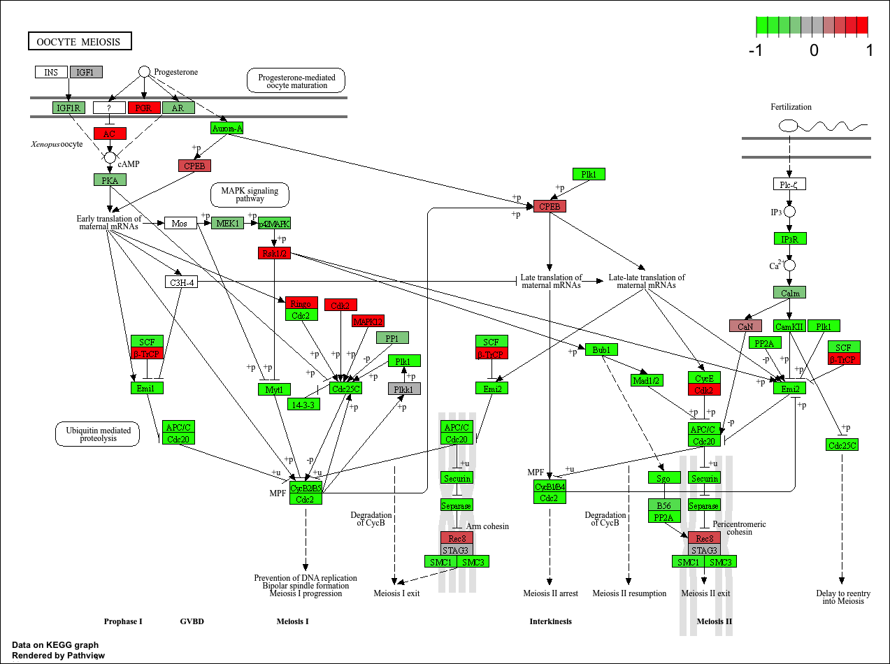
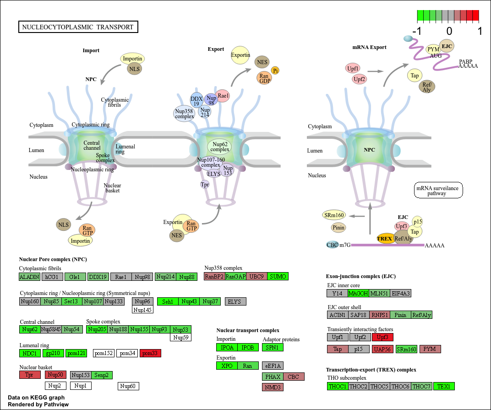

# Section 1: Differential Expression Analysis

```{r}
library(DESeq2)
metaFile <- "GSE37704_metadata.csv"
countFile <- "GSE37704_featurecounts.csv"

# Import metadata and take a peek
colData = read.csv(metaFile, row.names=1)
head(colData)
```

```{r}
# Import countdata
countData = read.csv(countFile, row.names=1)
head(countData)
```

**Q. Complete the code below to remove the troublesome first column from countData**

```{r}
# Note we need to remove the odd first $length col
countData <- as.matrix(countData[, -1])
head(countData)
```

**Q. Complete the code below to filter countData to exclude genes (i.e. rows) where we have 0 read count across all samples (i.e. columns).**

```{r}
# Filter count data where you have 0 read count across all samples.
countData = countData[rowSums(countData) > 1, ]
head(countData)
```

## Running DESeq2

```{r}
dds = DESeqDataSetFromMatrix(countData=countData,
                             colData=colData,
                             design=~condition)
dds = DESeq(dds)
dds
```

```{r}
res = results(dds)
```

**Q. Call the summary() function on your results to get a sense of how many genes are up or down-regulated at the default 0.1 p-value cutoff.**

```{r}
summary(res)
```

## Volcano Plot

```{r}
library(ggplot2)

# Volcano plot of log2 fold change vs -log adjusted p-value
ggplot(res) +
  aes(log2FoldChange,
      -log(padj)) +
  geom_point()
```

**Q. Improve this plot by completing the below code, which adds color, axis labels and cutoff lines:**

```{r}
# Make a color vector for all genes
mycols <- rep("gray", 15280 )

# Color blue the genes with fold change above 2
mycols[ abs(res$log2FoldChange) > 2 ] <- "blue"

# Color gray those with adjusted p-value more than 0.01
mycols[ res$padj > 0.01 ] <- "gray"

ggplot(res) +
  aes(log2FoldChange,
      -log(padj)) +
  geom_point(color = mycols) +
  xlab("Log2(FoldChange)") +
  ylab("-Log(P-value)") +
  geom_vline(xintercept = c(-2,2)) +
  geom_hline(yintercept = 0.05)
```

## Adding gene annotation

**Q. Use the mapIDs() function multiple times to add SYMBOL, ENTREZID and GENENAME annotation to our results by completing the code below.**

```{r}
library("AnnotationDbi")
library("org.Hs.eg.db")

columns(org.Hs.eg.db)

res$symbol = mapIds(org.Hs.eg.db,
                    keys=row.names(res), 
                    keytype="ENSEMBL",
                    column="SYMBOL",
                    multiVals="first")

res$entrez = mapIds(org.Hs.eg.db,
                    keys=row.names(res),
                    keytype="ENSEMBL",
                    column="ENTREZID",
                    multiVals="first")

res$name =   mapIds(org.Hs.eg.db,
                    keys=row.names(res),
                    keytype="ENSEMBL",
                    column="GENENAME",
                    multiVals="first")

head(res, 10)
```

**Q. Finally for this section let's reorder these results by adjusted p-value and save them to a CSV file in your current project directory.**

```{r}
res = res[order(res$pvalue),]
write.csv(res, file="deseq_results.csv")
```

# Section 2: Pathway Analysis

## KEGG pathways

```{r}
library(pathview)
library(gage)
library(gageData)

data(kegg.sets.hs)
data(sigmet.idx.hs)

# Focus on signaling and metabolic pathways only
kegg.sets.hs = kegg.sets.hs[sigmet.idx.hs]

# Examine the first 3 pathways
head(kegg.sets.hs, 3)
```

```{r}
foldchanges = res$log2FoldChange
names(foldchanges) = res$entrez
head(foldchanges)
```

```{r}
# Get the results
keggres = gage(foldchanges, gsets=kegg.sets.hs)

attributes(keggres)
```

```{r}
# Look at the first few down (less) pathways
head(keggres$less)
```

```{r}
pathview(gene.data=foldchanges, pathway.id="hsa04110")
```


```{r}
# A different PDF based output of the same data
pathview(gene.data=foldchanges, pathway.id="hsa04110", kegg.native=FALSE)
```


```{r}
## Focus on top 5 upregulated pathways here for demo purposes only
keggrespathways <- rownames(keggres$greater)[1:5]

# Extract the 8 character long IDs part of each string
keggresids = substr(keggrespathways, start=1, stop=8)
keggresids
```

```{r}
pathview(gene.data=foldchanges, pathway.id=keggresids, species="hsa")
```

    

**Q. Can you do the same procedure as above to plot the pathview figures for the top 5 down-regulated pathways?**

```{r}
## Focus on top 5 downregulated pathways
keggresdownpathways <- rownames(keggres$less)[1:5]

# Extract the 8 character long IDs part of each string
keggresdownids = substr(keggresdownpathways, start=1, stop=8)
keggresdownids
```

```{r}
pathview(gene.data=foldchanges, pathway.id=keggresdownids, species="hsa")
```

    

# Section 3: Gene Ontology (GO)

```{r}
data(go.sets.hs)
data(go.subs.hs)

# Focus on Biological Process subset of GO
gobpsets = go.sets.hs[go.subs.hs$BP]

gobpres = gage(foldchanges, gsets=gobpsets)

lapply(gobpres, head)
```

# Section 4: Reactome Analysis

```{r}
sig_genes <- res[res$padj <= 0.05 & !is.na(res$padj), "symbol"]
print(paste("Total number of significant genes:", length(sig_genes)))
```

```{r}
write.table(sig_genes, file="significant_genes.txt", row.names=FALSE, 
            col.names=FALSE, quote=FALSE)
```

**Pathway analysis performed on Reactome website**

**Q: What pathway has the most significant “Entities p-value”? Do the most significant pathways listed match your previous KEGG results? What factors could cause differences between the two methods?**

The pathway with the most significant "Entities p-value" is the Cell Cycle. The top five most significant pathways listed are Cell Cycle, Cell Cycle Mitotic, Cell Cycle Checkpoints, Mitotic Prometaphase, and Mitotic Spindle Checkpoint. The most significant KEGG result was the Cell Cycle as well, but the rest of the reults do not match those from the online pathway analysis. The difference in results could be due to differences in databases and the ways each analysis type classifies genes.
